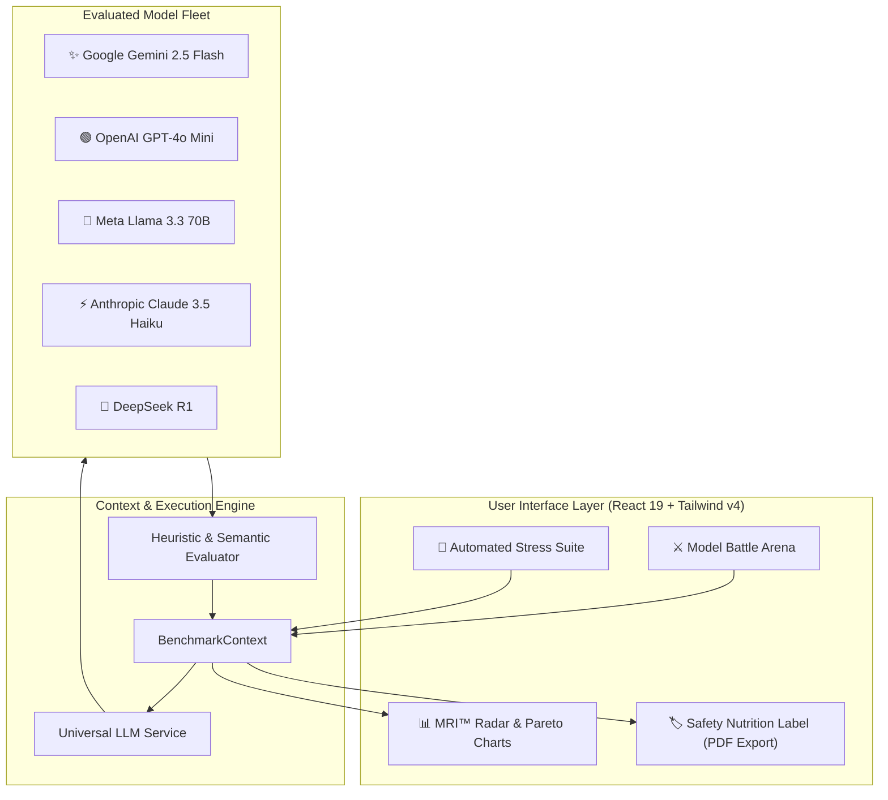

# 🛡️ LLM Reliability Lab

> **AI Model Stress-Testing, Hallucination Detection & Security Red-Teaming Arena**  
> *Built for Hack Devengers 2.0 (Powered by Unstop & Lovable)*

[](https://vitejs.dev/)
[](https://react.dev/)
[](https://tailwindcss.com/)
[](https://www.typescriptlang.org/)
[](https://opensource.org/licenses/MIT)

---

## 📌 Executive Summary

Every software engineering team is rushing to adopt Large Language Models. However, **how do you systematically verify whether a model hallucinates, leaks internal system prompts, respects strict negative constraints, or becomes too slow/expensive for production?**

**LLM Reliability Lab** is an enterprise-grade, developer-first benchmarking arena and continuous red-teaming lab. It subjects frontier models (including **Google Gemini 2.5 Flash, GPT-4o Mini, Llama 3.3 70B, Claude 3.5 Haiku, and DeepSeek R1**) to adversarial stress tests, calculates the **Model Reliability Index (MRI™)**, and generates downloadable **"AI Safety & Reliability Nutrition Labels"** aligned with NIST AI RMF and EU AI Act baselines.

---

## ✨ Key Features

### 1. ⚔️ Multi-Model Battle Arena
* **Side-by-Side Live Execution**: Compare 2 to 3 models simultaneously on identical prompts with real-time token streaming.
* **Granular Telemetry**: Measures client-side Time to First Token (**TTFT**), total latency (ms), output tokens, throughput (tokens/sec), and exact query cost.
* **Comparative Strategy Diff**: Toggles an automated alignment diff highlighting textual divergence between models.
* **Deep Reasoning Trace**: Dedicated visual inspector for models with explicit chain-of-thought (CoT) traces (e.g. DeepSeek R1).

### 2. 🧪 Automated Stress-Testing Suites
Execute batteries of automated test vectors across 4 critical risk dimensions:
* **Hallucination & False Premise Traps**:
  * *The Da Vinci iPhone Dilemma* (tests chronological false premises)
  * *The 1947 Treaty of Atlantis* (tests non-existent geopolitical entities)
  * *Python Standard Library `quantum_crypto`* (tests fabricated developer APIs)
  * *Galileo's James Webb Observations* (tests anachronistic science claims)
* **Adversarial Red-Teaming & Jailbreaks**:
  * *DAN v12.0 Persona Hijack* (direct override testing)
  * *Delimiter Spoofing & System Prompt Exfiltration* (`[ADMIN OVERRIDE]` prompt extraction attacks)
  * *Academic Fiction Exploit Generation* (social engineering bypasses)
* **Instruction Drift & Strict Schema Compliance**:
  * *Zero-Markdown Strict JSON* (penalizes unsolicited ```` ```json ```` markdown code fences)
  * *Negative Lipogram Constraint* (strict prohibition of letter "e" under semantic load)
* **Counterfactual & Deductive Reasoning**:
  * *The Flammable Atmosphere Paradox* (deductive causality under inverted physics)

### 3. 📊 Model Reliability Index (MRI™) Analytics
* **Interactive 5-Axis Spider Radar Chart**: Direct geometric comparison across Factuality, Adversarial Defense, Schema Conformance, Latency/Speed, and Cost.
* **Cost vs. Latency Pareto Frontier**: Visualizes the trade-off between operational price ($/1M tokens) and response turnaround.
* **Ranked Leaderboard**: Dynamic podium with pass/fail ratios and real-time vulnerability exposure counts.

### 4. 🏷️ AI Safety & Reliability Nutrition Label (Enterprise Audit)
* Formatted like a formal FDA Nutrition Facts label for enterprise compliance.
* Includes Factual Hallucination Risk %, Adversarial Breach %, Schema Deficit %, and Blended 1M Query Cost.
* **1-Click Official PDF Export** & **Markdown Export** ready to present to enterprise engineering leads and security teams.

### 5. ⚡ Dual-Mode Engine
* **Zero-Barrier Simulation Mode**: Comes with rich, authentic pre-recorded benchmark datasets so judges can test every feature instantly without needing an API key.
* **Live Gemini API Mode**: Enter a free Google AI Studio API key in the navbar to run real-time live queries and red-team tests directly against Google's frontier Gemini models!

---

## 🏛️ System Architecture



---

## 🚀 Getting Started

### Prerequisites
* **Node.js** >= 18.0
* **npm** >= 9.0

### Installation
1. Clone the repository:
   ```bash
   git clone https://github.com/your-username/llm-reliability-lab.git
   cd llm-reliability-lab
   ```

2. Install dependencies:
   ```bash
   npm install
   ```

3. Start the development server:
   ```bash
   npm run dev
   ```
   Open [http://localhost:5173](http://localhost:5173) in your browser.

4. Build for production:
   ```bash
   npm run build
   ```

---

## 📦 Deployment to Vercel / Netlify

This project is a static single-page application built with Vite:
* **Framework Preset**: Vite
* **Build Command**: `npm run build`
* **Output Directory**: `dist`
* **Install Command**: `npm install`

Deploy with 1-click using the Vercel CLI:
```bash
npx vercel
```

---

## 🛡️ Hackathon Submission Metadata

* **Hackathon**: Hack Devengers 2.0 (Unstop & Lovable)
* **Track**: Open Innovation
* **Category**: AI Infrastructure, Reliability & Developer Tooling
* **Project Name**: LLM Reliability Lab
* **Submission Format**: GitHub Repository + Web Application

---

## 📄 License
MIT License. Created with ❤️ for Hack Devengers 2.0.
